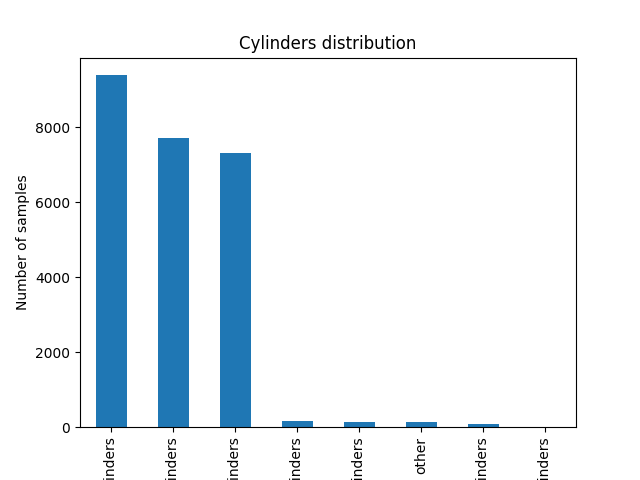

# Proiect PCLP3
## Radulescu Andrei-Valentin 311CC
## Model de predictie al pretului unui autoturism

### Top-down

Am ales sa fac o implementare a unui model de regresie liniara care va avea ca date de intrare caracteristicile unei masini si va estima pretul de vanzare.

Am preluat un [dataset de pe kaggle](https://www.kaggle.com/datasets/austinreese/craigslist-carstrucks-data?resource=download) din care am preluat o parte(10%) din linii, acesta avant peste `400 000` de intrari. Nu am considerat necesar sa adaug colone, fiind deja 25, iar zgomotul nu a fost necesar sa fie introdus, datasetul fiind real, acumulat cu un data scraper. Tipurile de date sunt variate, regasind atat siruri de caractere, valori categoriale si numerice.

### Prelucrarea datelor

Am renuntat la coloanele care nu sunt relevante pentru estimarea pretului, precum ID, data postarii anuntului,link-uri,VIN, etc. Apoi analizam structura datasetului
```RangeIndex: 42688 entries, 0 to 42687
Data columns (total 19 columns):
 #   Column        Non-Null Count  Dtype
---  ------        --------------  -----
 0   Unnamed: 0    42688 non-null  int64
 1   region        42688 non-null  object
 2   price         42688 non-null  int64
 3   year          42565 non-null  float64
 4   manufacturer  40905 non-null  object
 5   model         42171 non-null  object
 6   condition     25238 non-null  object
 7   cylinders     24929 non-null  object
 8   fuel          42391 non-null  object
 9   odometer      42269 non-null  float64
 10  title_status  41897 non-null  object
 11  transmission  42441 non-null  object
 12  drive         29667 non-null  object
 13  size          12137 non-null  object
 14  type          33475 non-null  object
 15  paint_color   29747 non-null  object
 16  description   42684 non-null  object
 17  county        0 non-null      float64
 18  state         42688 non-null  object
dtypes: float64(3), int64(2), object(14) 
```

Asadar, observam la county ca nu avem intrari, deci eliminam. De asemenea, condition si cylinders au multe valori lipsa(~40%).


Observam ca valorile sunt concentrate pe good/excelent deci nu putem interpola pentru 40% din valori lipsa. Renuntam la aceasta coloana




Acceasi situatie o intalnim si la cylinders, valorile fiind distribuite aproape egal intre 4 6 si 8. Renuntam si la aceasta.

Pentru drive avem ~30% date lipsa.


Pentru a umple valorile lipsa vom folosi valoarea predominanta(4wd).Trebuie sa asociem fiecarui label o valoare numarica. Pentru ca sunt caracteristici independete, s-ar potrivi un one-hot encoder.

region (price) year manuf model fuel odometer title_status transmission size type paint_color description state