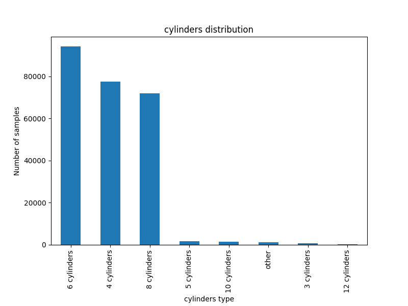
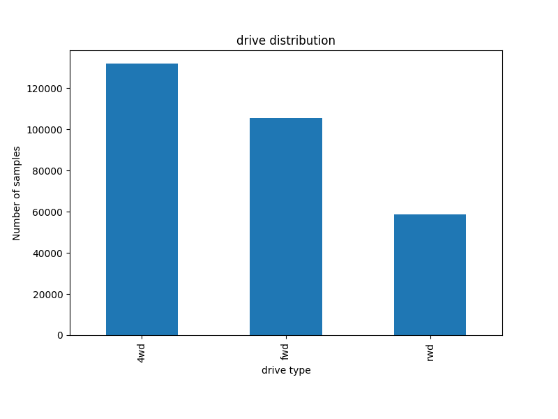
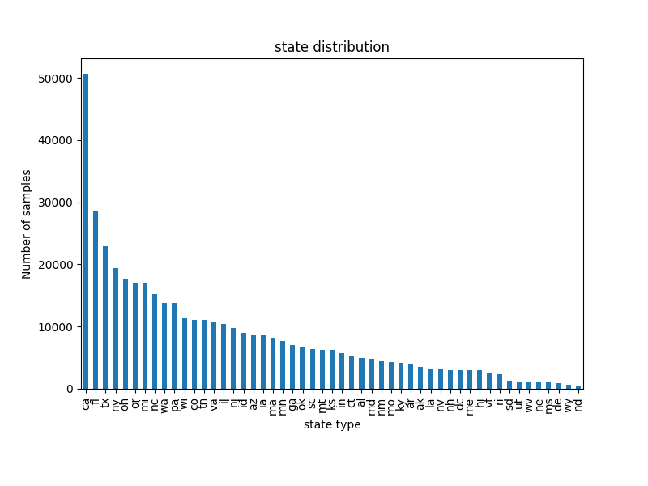
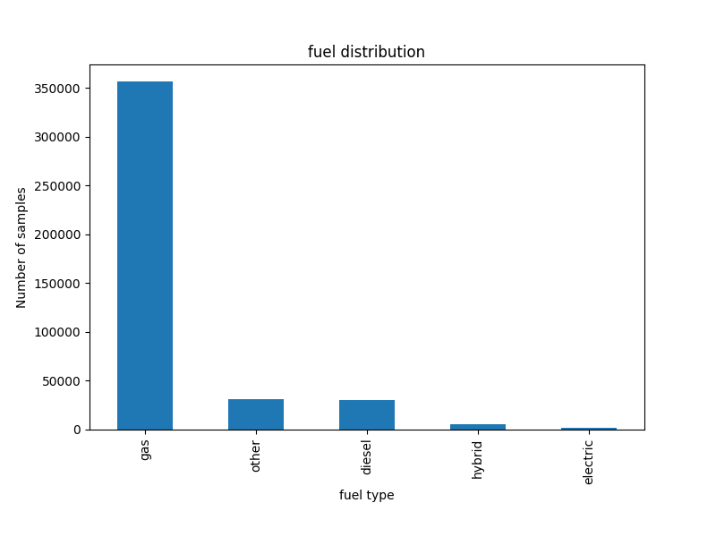
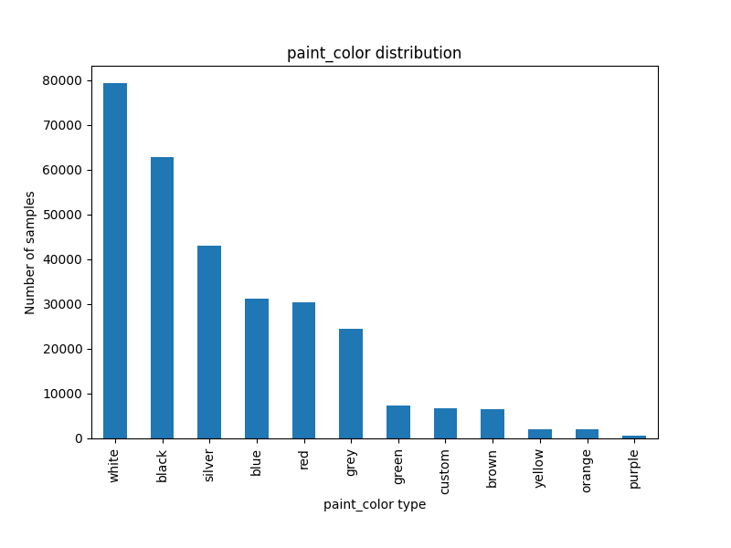
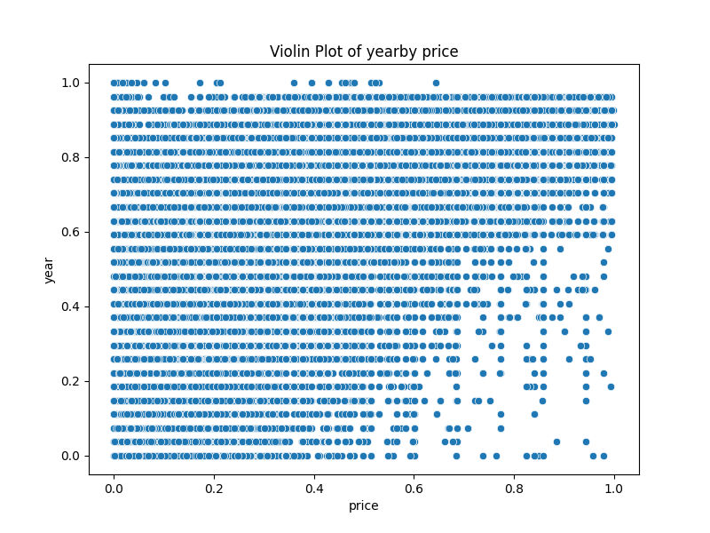

# Proiect PCLP3

## Radulescu Andrei-Valentin 311CC

## Model de predictie al pretului unui autoturism

### Top-down

Am ales sa fac o implementare a unui model de regresie liniara care va avea ca
date de intrare caracteristicile unei masini si va estima pretul de vanzare.

Am preluat un
[dataset de pe kaggle](https://www.kaggle.com/datasets/austinreese/craigslist-carstrucks-data?resource=download)
din care am lasat o parte(10%) din linii in repo, acesta avant peste `400 000`
de intrari. Modelul a fost antrenat pe tot datasetul. Nu am considerat necesar
sa adaug colone, fiind deja 25, iar zgomotul nu a fost necesar sa fie introdus,
datasetul fiind real, acumulat cu un data scraper. Tipurile de date sunt
variate, regasind atat siruri de caractere, valori categoriale si numerice. De
asemenea, descrierea nu ar trebui sa influenteze, deci eliminam.

### Prelucrarea datelor(pe tot datasetul)

Am renuntat la coloanele care nu sunt relevante pentru estimarea pretului,
precum ID, data postarii anuntului,link-uri,VIN,descriere . Apoi analizam
structura datasetului

```
 #   Column        Non-Null Count   Dtype
---  ------        --------------   -----
 0   region        426880 non-null  object
 1   price         426880 non-null  int64
 2   year          425675 non-null  float64
 3   manufacturer  409234 non-null  object
 4   model         421603 non-null  object
 5   condition     252776 non-null  object
 6   cylinders     249202 non-null  object
 7   fuel          423867 non-null  object
 8   odometer      422480 non-null  float64
 9   title_status  418638 non-null  object
 10  transmission  424324 non-null  object
 11  drive         296313 non-null  object
 12  size          120519 non-null  object
 13  type          334022 non-null  object
 14  paint_color   296677 non-null  object
 15  state         426880 non-null  object
```

## Date categoriale

Pentru fiecare coloana pe care o pastrez, umplu golurile cu valoarea
predominanta si encodez fie one-hot fie label.

### County

Asadar, observam la county ca nu avem intrari, deci eliminam.

### Condition


Observam ca valorile sunt concentrate pe good/excelent deci nu putem interpola
pentru 40% din valori lipsa. Renuntam la aceasta coloana

### Cylinder



Acceasi situatie o intalnim(40% lipsa) si la cylinders, valorile fiind
distribuite aproape egal intre 4 6 si 8. Renuntam si la aceasta.

### Drive



Pentru drive avem ~30% date lipsa. Pentru a umple valorile lipsa vom folosi
valoarea predominanta(4wd ~ 131904(30%)).Trebuie sa asociem fiecarui label o
valoare numarica. Pentru ca sunt caracteristici independete, s-ar potrivi un
one-hot encoder.

### State



Avem coloanele cu informatie similara region si state. Region contine 404
valori unice iar state 51(ca ~ 50614(12%)). Fiind informatie oarecum redundanta,
aleg sa pastrez doar state, facand presupunerea ca in interiorul unui stat nu
variaza atat de mult pretul. Nu avem valori nule. Observam o concentrare a
valorilor in primele 3 state ceea ce poate duce la un favoritism, avand mai
multe date acolo.

### Title


Pentru title status ne lipsesc ~2%(8242 valori) din valori si avem 6 valori
unice.

Pe cele lipsa le vom inlocui cu clean, acesta fiind predominant. Apoi, fiind
relevanta ordinea(conditie din ce in ce mai rea), vom encoda cu un numar de la
0-5. Si aici avem o majoritate(clean ~ 405117(95%)) ceea ce va putea duce la
ignorarea celorlalte valori.

### Manufacturer & model


Avem 42 de valori unice, Ford fiind predominant 70985(~17%). Si aici vor fi,
probabil, prea putine valori pentru celelalte ceea ce va duce la erori. In ceea
ce priveste modelul, avem 8430 de valori unice. Fiind atat de dispersate nu vor
aduce un plus considerabil, deci pastram doar manufacturer. Ca pana acum,
adaugam valoarea predominanta unde sunt lipsa si aplicam un label encoder.

### Fuel



Avem 5 categorii, gas predominant(356209~83%). Aplicam acceasi procedura. Si
aici va fi probabil o preferinta pentru gas

### Size, transmission, type,paint color

Repetam aceleasi proceduri. 


Size are 70% valori lipsa, nu se pot interpola deci stergem.

 

1% valori lipsa, predominant automatic(78%). Poate crea un dezechilibru.


22% valori lipsa, 20% sedan.



30% lipsa, 18% albe

## Date numerice

### Year

Avem 425675 valori(98%) cu media 2011. Deviatia standard e 9.45. 

Majoritatea sunt dupa anii 2008. Umplem valorile lipsa cu media. Aplicam IQR
pentru a scoate outlierele

### Kilometraj(odometer)


406623 valori(95%) cu media 95756 km si deviatia 159939.


Aplicam aceleasi masuri ca la price.

### Price

Media este 68297 inainte de normalizare. Dupa normalizare, media e 16594 su deviatia standard 13256


Aplicam aceleasi masuri ca la price.

## Analiza corelatii


Vedem ca pretul este influentat de year si transmission (proportional) si
invers proportional cu kilometraj si fwd.

Dintre modele cel mai bun(dupa mean squared error) e linear regression cu
eroare de ~0.132.




Nu ne putem da seama de un pattern clar, se poate intui unul liniar la ani, insa vag.

## Antrenarea modelului

Am ales un model de regresie liniara si un split 80/20.
Acuratete MAE:0.13
Acuratete RMSE:0.18
Acuratete R2:0.37

