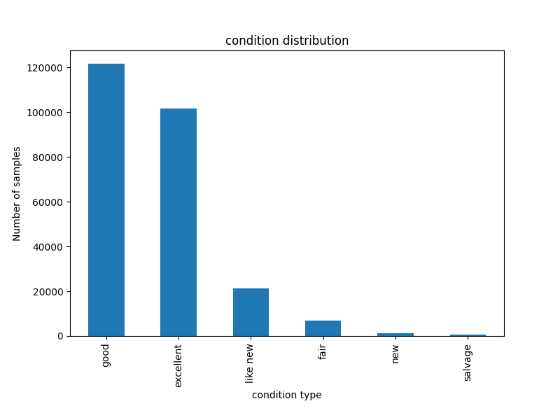
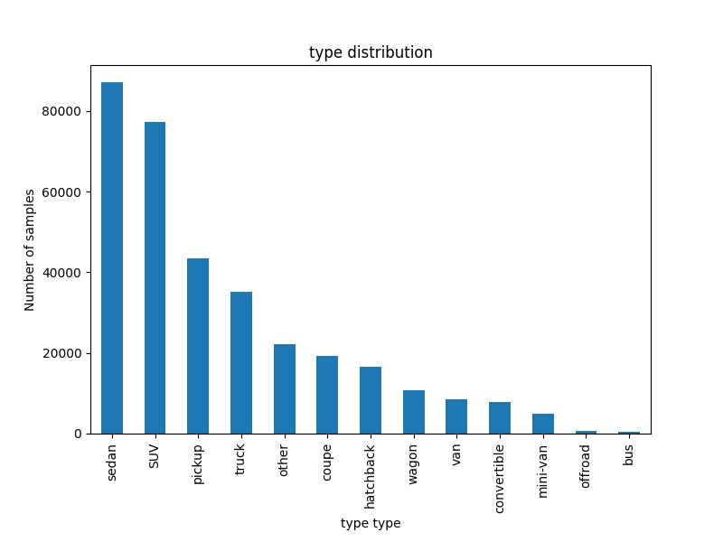
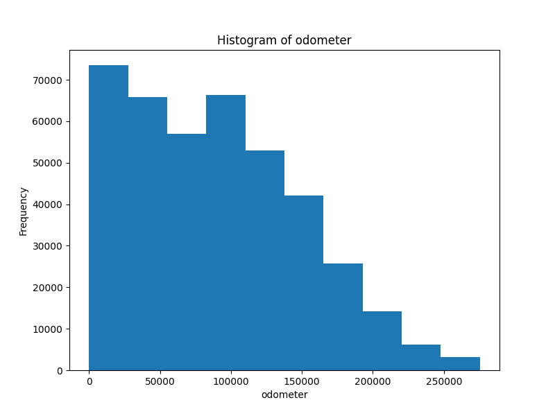

# Proiect PCLP3

## Radulescu Andrei-Valentin 311CC

## Model de predictie al pretului unui autoturism

### Top-down

Am ales sa fac o implementare a unui model de regresie liniara care va avea ca
date de intrare caracteristicile unei masini si va estima pretul de vanzare.

Am preluat un
[dataset de pe kaggle](https://www.kaggle.com/datasets/austinreese/craigslist-carstrucks-data?resource=download)
din care am preluat o parte(10%) din linii, acesta avant peste `400 000` de
intrari. Nu am considerat necesar sa adaug colone, fiind deja 25, iar zgomotul
nu a fost necesar sa fie introdus, datasetul fiind real, acumulat cu un data
scraper. Tipurile de date sunt variate, regasind atat siruri de caractere,
valori categoriale si numerice. De asemenea, descrierea nu ar trebui sa
influenteze, deci eliminam.

### Prelucrarea datelor

Am renuntat la coloanele care nu sunt relevante pentru estimarea pretului,
precum ID, data postarii anuntului,link-uri,VIN, etc. Apoi analizam structura
datasetului

```RangeIndex: 42688 entries, 0 to 42687
Data columns (total 19 columns):
 #   Column        Non-Null Count  Dtype
---  ------        --------------  -----
 0   Unnamed: 0    42688 non-null  int64
 1   region        42688 non-null  object
 2   price         42688 non-null  int64
 3   year          42565 non-null  float64
 4   manufacturer  40905 non-null  object
 5   model         42171 non-null  object
 6   condition     25238 non-null  object
 7   cylinders     24929 non-null  object
 8   fuel          42391 non-null  object
 9   odometer      42269 non-null  float64
 10  title_status  41897 non-null  object
 11  transmission  42441 non-null  object
 12  drive         29667 non-null  object
 13  size          12137 non-null  object
 14  type          33475 non-null  object
 15  paint_color   29747 non-null  object
 16  county        0 non-null      float64
 17  state         42688 non-null  object
dtypes: float64(3), int64(2), object(13)
```

## Date categoriale

### County

Asadar, observam la county ca nu avem intrari, deci eliminam. De asemenea,
condition si cylinders au multe valori lipsa(~40%).

### Condition



Observam ca valorile sunt concentrate pe good/excelent deci nu putem interpola
pentru 40% din valori lipsa. Renuntam la aceasta coloana

### Cylinder


Acceasi situatie o intalnim si la cylinders, valorile fiind distribuite aproape
egal intre 4 6 si 8. Renuntam si la aceasta.

### Drive


Pentru drive avem ~30% date lipsa. Pentru a umple valorile lipsa vom folosi
valoarea predominanta(4wd ~ 13114(30%)).Trebuie sa asociem fiecarui label o
valoare numarica. Pentru ca sunt caracteristici independete, s-ar potrivi un
one-hot encoder.

### State


Avem coloanele cu informatie similara region si state. Region contine 403
valori unice iar state 51(ca ~ 5129(12%)). Fiind informatie oarecum redundanta,
aleg sa pastrez doar state, facand presupunerea ca in interiorul unui stat nu
variaza atat de mult pretul. Nu avem valori nule. Observam o concentrare a
valorilor in primele 3 state ceea ce poate duce la un favoritism, avand mai
multe date acolo.

### Title


Pentru title status ne lipsesc ~2%(791 valori) din valori si avem 6 valori
unice.

Pe cele lipsa le vom inlocui cu clean, acesta fiind predominant. Apoi, fiind
relevanta ordinea(conditie din ce in ce mai rea), vom encoda cu un numar de la
0-5. Si aici avem o majoritate(clean ~ 40521(95%)) ceea ce va putea duce la
ignorarea celorlalte valori.

### Manufacturer & model


Avem 41 de valori unice, Ford fiind predominant 7242(~17%). Si aici vor fi,
probabil, prea putine valori pentru celelalte ceea ce va duce la erori. In ceea
ce priveste modelul, avem 8430 de valori unice. Fiind atat de dispersate nu vor
aduce un plus considerabil, deci pastram doar manufacturer. Ca pana acum,
adaugam valoarea predominanta unde sunt lipsa si aplicam un label encoder.

### Fuel


Avem 5 categorii, gas predominang(35580~83%). Aplicam acceasi procedura. Si
aici va fi probabil o preferinta pentru gas

### Size, transmission, type,paint color

Repetam aceleasi proceduri. 
 


## Date numerice

### Year

Avem 41897 valori(98%) cu media 2011. 

Majoritatea sunt dupa anii 1980. Umplem valorile lipsa cu media. Aplicam IQR
pentru a scoate outlierele

### Kilometraj(odometer)

4059 valori(95%) cu media 96225 km si deviatia 184502.


Aplicam aceleasi masuri ca la price.

## Analiza corelatii


Vedem ca pretul nu este influentat de vreo variabila in mod special, insa
exista o corelatie intre an si transmission, una inversa fata de
incidente(title) si fata de kilometraj.

TODO scatter plots, train model, interface
